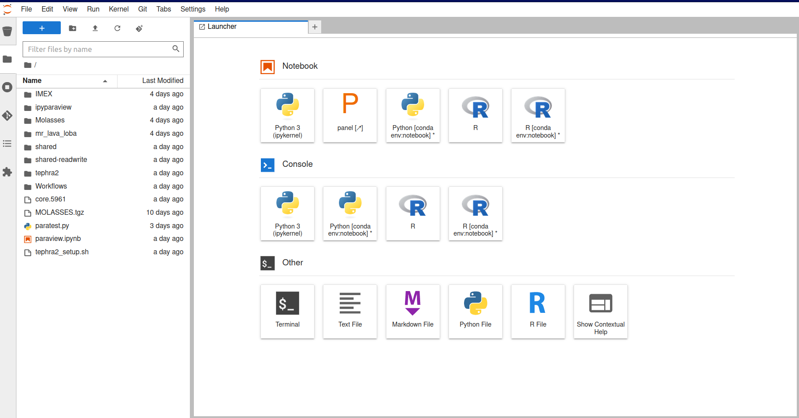

Usage
=====

.. _register:

Registration
------------

To gain access to VICTOR, you must first register. Currently, we are authenticating users through Github, and thus all users 
are required to possess an account. To register, please visit the VICTOR website_ and press the register button in the top right.
This will direct you to a form where you can provide the neccesary information.

.. _website: https://localhost:9999

.. _runmodels:

Once you are able to access the hub, you will see a screen very similar to this:

Run Models
------------

To run models, there are a few simple steps. First, navigate to the ``shared`` folder. You can either run the the ``*****_setup.sh``
 files directly, or copy one, either through manual selection (right click + copy) with the mouse, or through the terminal with ``cp shared/*****_setup.sh .`` when you are in the home directory.

.. note::

   All files in the ``shared`` folder are read/execute only. If you would like to contribute models, data, or ideas for improvement,
   please contact victor@ldeo.columbia.edu.

Once this runs, you will have all necessary files contained in a new folder in your home directory. Most folders will simply contain the executable
and the example notebook. All Juptyter notebook workflows will generate most of the supplemental files necessary for the model to run.

However, DEMs are not automatically included. Users then have 4 primary options: 
1. Navigate to the DEMs folder in ``shared`` and copy the relevant file to your home directory, if the file needs to be altered.
2. Read the DEM from ``$HOME/shared/DEMs`` directly in your workflow, if no changes are required.
3. Import your own DEM from a local machine, dragging and dropping into the file tree.
4. Utilize S3 buckets or an SQL connection (using boto3 or mysql python packages) to load files remotely. 

At this point, users can go through the first few cells immediately succeeding the import statement, inputting parameters as needed.
Thorough descriptions of each parameter are included. Once finished, the user can simply press the fast forward symbol to run all cells, or ``shift + enter/return`` to run each cell individually.

Citations and References
------------------------
Below are citations and related works used to create this project. To add additional citations or for clarification, contact victor@ldeo.columbia.edu

**IMEX-Lava**
Elisa Biaioli's thesis: https://dx.doi.org/10.15167/biagioli-elisa_phd2021-10-27

E. Biagioli, M. de’ Michieli Vitturi, and F. Di Benedetto. Modified shallow water model for viscous fluids and positivity preserving numerical approximation. Applied Mathematical Modeling, 94:482–505, 2021. doi: 10.1016/j.apm.2020.12.036.

M. de’ Michieli Vitturi, T. Esposti Ongaro, G. Lari, and A. Aravena. IMEX_SfloW2D 1.0. a depth-averaged numerical flow model for pyroclastic avalanches. Geosci. Model Dev., 12: 581–595, 2019. doi: 10.5194/gmd-12-581-2019.

**MrLavaLoba**

M. de' Michieli Vitturi and S. Tarquini. MrLavaLoba: A new probabilistic model for the simulation of lava flows as a settling process,
Journal of Volcanology and Geothermal Research, Volume 349, 2018, Pages 323-334, ISSN 0377-0273, https://doi.org/10.1016/j.jvolgeores.2017.11.016.

**Molasses**

Connor, L. J., Connor, C. B., Meliksetian, K., & Savov, I. (2012) Probabilistic approach to modeling lava flow inundation: a lava flow hazard assessment for a nuclear facility in Armenia. Journal of Applied Volcanology (1):3. DOI 10.1186/2191-5040-1-3

Kubanek, J., Richardson, J. A., Charbonnier, S. J., & Connor, L. J. (2015) Lava flow mapping and volume calculations for the 2012–2013 Tolbachik, Kamchatka, fissure eruption using bistatic TanDEM-X InSAR. Bulletin of Volcanology 77(12):106. DOI 10.1007/s00445-015-0989-9 

Contributing Models and Hub Additions
-------------------------------------
If you believe your model would be a good fit for our platform, please email victor@ldeo.columbia.edu with a link to the code on a version-control platform
as well as a brief explanation. For additions to the hub itself, please refer to `our Github repository`_. Create an issue for general advice,
or create a pull request for specific changes/updates.  

.. _our Github repository: https://github.com/volcanocyber/VICTOR-notebook

.. code-block:: console

   (.venv) $ pip install lumache

