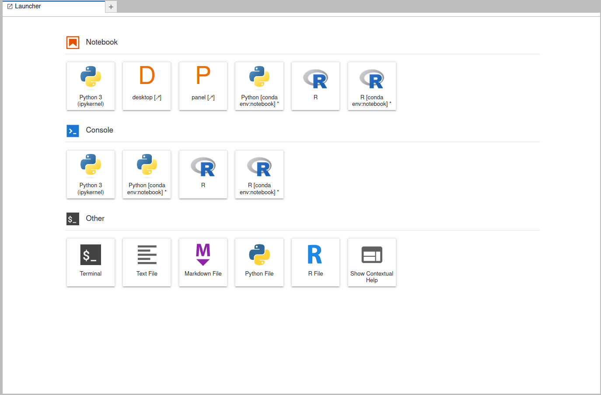

Usage
=====

.. _register:

Registration
------------

To gain access to VICTOR, you must first register. Currently, we are authenticating users through Github, and thus all users 
are required to possess an account. To register, please visit the VICTOR website_ and click on the *Sign Up* button on the right of the menu.
This will direct you to a form where you can provide the neccesary information.

.. _website: https://victor.ldeo.columbia.edu

.. _runmodels:

Choose an Environment
----------------------

On initial login to the hub, you will be prompted to select an environment. You can choose a machine with a or without a GPU. The VICTOR team recommends the
machines without GPU access unless CUDA or similar high peformance frameworks are used in one's work.

There are three images available to choose from. The first image is the default VICTOR environment, and the only one configured to run models. The majority of users should choose this.
The Pangeo images prioritize the larger machine learning packages, PyTorch and TensorFlow in particular. These are recommended for advanced users.

Finally, you must choose a resource allocation for your image. The equivalent to a modern laptop is the 7.4 GB allocation. If running light models or none at all,
smaller machines are recommended, and will also save our team money! For heavy workloads, use up to 60.6 GB of RAM. If a need arises to use the the 121.2 GB allocation,
please contact victor@ldeo.columbia.edu so we can prepare accordingly.

Once you are able to access the hub, you will see a screen very similar to this:

The Launcher
-------------
The first screen you will be met with is the launcher, providing an variety of environments to utilize.
The first row of buttons is comprised of highly interactive Jupyter notebooks, as well as the desktop application.
The VICTOR team advises using only the ``[conda env: notebook]`` tabs, as this is the environment that includes all the
neccesary scientific packages for utilizing and visualizing models.

The second row of buttons opens consoles, a simplified interactive environment where you can enter
lines of code and run them, though not able to embed images or renderings such as matplotlib.

The final row of buttons provides quick access to static files in various languages, as well as for a simple text file.
Additionally, access to a bash terminal is accessible here, allowing for advanced users to maximize productivity in this environment.

Run Models
------------

To run models, there are a few simple steps. First, navigate to the ``shared`` folder. You can either run the the ``*****_setup.sh``
files directly, or copy one, either through manual selection (right click + copy) with the mouse, or through the terminal with ``cp shared/*****_setup.sh .`` when you are in the home directory.

.. note::

   All files in the ``shared`` folder are read/execute only. If you would like to contribute models, data, or ideas for improvement,
   please contact victor@ldeo.columbia.edu.

Once this runs, you will have all necessary files contained in a new folder in your home directory. Most folders will simply contain the executable
and the example notebook. All Juptyter notebook workflows will generate most of the supplemental files necessary for the model to run.

However, DEMs are not automatically included. Users then have 4 primary options: 
1. Navigate to the DEMs folder in ``shared`` and copy the relevant file to your home directory, if the file needs to be altered.
2. Read the DEM from ``$HOME/shared/DEMs`` directly in your workflow, if no changes are required.
3. Import your own DEM from a local machine, dragging and dropping into the file tree.
4. Utilize S3 buckets or an SQL connection (using boto3 or mysql python packages) to load files remotely. 

At this point, users can go through the first few cells immediately succeeding the import statement, inputting parameters as needed.
Thorough descriptions of each parameter are included. Once finished, the user can simply press the fast forward symbol to run all cells, or ``shift + enter/return`` to run each cell individually.

Accessing The Virtual Desktop
---------------------------
Upon clicking the desktop button on the launcher, another tab will open, displaying a screen as seen below. From here, you
can access a fully featured QGIS installation, with many other programs scheduled to be added as well. The file system is connected to
your personal files, and a web browser is also available for your convenience. 

Citations and References
------------------------
Below are citations and related works used to create this project. To add additional citations or for clarification, contact victor@ldeo.columbia.edu

**Conflow**

See :ref:`Conflow Citations` here.

**Hazmap**

See :ref:`Hazmap Citations` here.

**HYSPLIT**

See :ref:`Hysplit Citations` here.

**IMEX-Lava**

See :ref:`IMEX Citations` here.

**Molasses**

See :ref:`Molasses Citations` here.

**MrLavaLoba**

See :ref:`MrLavaLoba Citations` here.

**pyFLOWGO**

See :ref:`pyFLOWGO Citations` here.

**Sulfur_X**

See :ref:`Sulfur_X Citations` here.

**Scoops3D**

See :ref:`Scoops3D Citations` here.

**Tephra2**

See :ref:`Tephra2 Citations` here.

**Titan2D**

See :ref:`Titan2D Citations` here.

**VENUSS**

See :ref:`VENUSS Citations` here.

**VolcFlow**

See :ref:`VolcFlow Citations` here.
Contributing Models and Hub Additions
-------------------------------------
If you believe your model would be a good fit for our platform, please email victor@ldeo.columbia.edu with a link to the code on a version-control platform
as well as a brief explanation. For additions to the hub itself, please refer to `our Github repository`_. Create an issue for general advice,
or create a pull request for specific changes/updates.  

.. _our Github repository: https://github.com/volcanocyber/VICTOR-notebook
